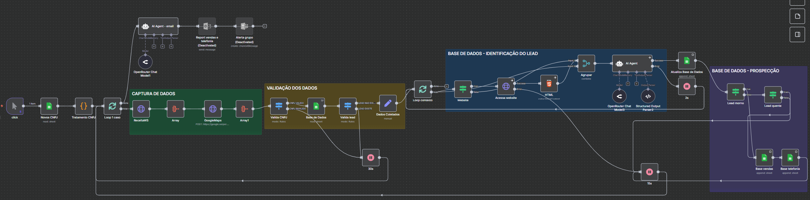

# 🚀 Intelligent B2B Lead Scoring Automation

> An **n8n** automation pipeline that captures, validates, enriches, and classifies B2B leads in the **construction & building-materials** sector, generating a **commercial potential score (0–100)** powered by AI.

<p align="left">
  
  
  
  
  
  
</p>

**🌐 Language:** [Português](README.md) · **English**

---

## 🎬 Flow Overview

<!--
  GIF of the workflow running in n8n. To generate one:
  1. Open the workflow in n8n and click "Execute Workflow".
  2. Record the screen (ScreenToGif on Windows, or Kap/Gifox on Mac) for ~10-15s.
  3. Save it as flow/demo.gif and uncomment the line below.
-->
<!--  -->



The pipeline turns a **spreadsheet of CNPJs** (Brazilian company tax IDs) into a **qualified, prioritized lead base** ready for the sales team — at **near-zero operating cost** (public APIs + an open-source AI model).

```
Spreadsheet of CNPJs
      │
      ▼
Receita Federal API  +  Google Maps API      ← 1. Capture
      │
      ▼
Registration validation (active CNPJ?)        ← 2. Validation
      │
      ▼
Deduplication (already processed?)            ← 3. Anti-rework
      │
      ▼
Digital enrichment (website scraping)         ← 4. Enrichment
      │
      ▼
AI module → score 0–100 + JSON                ← 5. Classification
      │
      ▼
Classified Lead Base (🔥 / 🌤 / ❄)
```

---

## 🎯 The Problem It Solves

B2B sales teams spend hours qualifying leads by hand — checking tax IDs, hunting for websites, judging company size and reputation. This project **automates that triage** and delivers each lead already scored and with **suggested next actions**, so reps can focus only on the leads with the highest conversion potential.

---

## 📊 Real Output Example

The AI returns **valid JSON only** (no free text), following a [strict schema](docs/schema.json). Example of a lead classified as **🔥 Hot**:

| Field | Value |
|-------|-------|
| **Company name** | Beta Distribuidora de Materiais LTDA |
| **CNPJ** | 23.456.789/0001-12 · `ACTIVE` |
| **Industry** | Wholesale of construction materials |
| **Score** | **87 / 100** |
| **Classification** | 🔥 **Hot** |
| **AI confidence** | 0.93 |
| **Next action** | Initial phone call → company deck → meeting |

<details>
<summary>📄 View the full JSON response</summary>

```json
{
  "razao_social": "Beta Distribuidora de Materiais LTDA",
  "cnpj": "23.456.789/0001-12",
  "ramo": "Comércio atacadista de materiais de construção",
  "overall_score": 87,
  "bucket": "quente",
  "confidence": 0.93,
  "signals_positive": [
    "CNPJ ativo e regular",
    "Segmento alinhado ao setor de construção civil",
    "Website ativo com informações institucionais",
    "Boa avaliação no Google Maps",
    "Presença ativa em redes sociais"
  ],
  "signals_negative": [
    "Capital social moderado comparado a grandes distribuidores"
  ],
  "rationale": "Lead apresenta maturidade operacional, reputação online positiva e forte compatibilidade com o segmento de materiais de construção.",
  "next_actions": [
    "Contato telefônico inicial para qualificação comercial",
    "Envio de apresentação institucional",
    "Agendamento de reunião com representante comercial"
  ]
}
```

> The AI output fields are kept in Portuguese to match the source data and the defined schema. See the full example in [`examples/sample-output.json`](examples/sample-output.json).

</details>

---

## 🧮 Scoring Logic

The score combines **deterministic rules** (fixed points) with **AI contextual analysis**.

| Criterion | Points | What it evaluates |
|-----------|:------:|-------------------|
| **Registration Validity** | 25 | Active CNPJ, valid legal nature, defined company size |
| **Digital Contact** | 25 | Phone, e-mail, website, hours, identified partners |
| **Business Stability** | 20 | Time in market + share capital |
| **Commercial Potential** | 20 | Fit with the ICP (construction sector) |
| **Online Reputation** | 10 | Google Maps presence and reviews |
| **Total** | **100** | |

### Classification buckets

| Score | Classification |
|:-----:|:--------------:|
| `80–100` | 🔥 Hot lead |
| `60–79` | 🌤 Warm lead |
| `0–59` | ❄ Cold lead |

📖 Full breakdown in [`docs/scoring-logic.md`](docs/scoring-logic.md).

---

## 🏗 Architecture

The flow is split into **5 independent, modular layers**:

| # | Stage | Responsibility |
|:-:|-------|----------------|
| 1️⃣ | **Data Ingestion** | Query Receita Federal + Google Maps per CNPJ |
| 2️⃣ | **Registration Validation** | Discard non-existent or inactive CNPJs |
| 3️⃣ | **Smart Deduplication** | Skip already-processed CNPJs (API savings) |
| 4️⃣ | **Digital Enrichment** | Website scraping → HTML → structured JSON |
| 5️⃣ | **AI Classification** | Score 0–100 + bucket + signals + next actions |

📖 Detailed documentation in [`docs/architecture.md`](docs/architecture.md).

---

## 🧠 AI Strategy

The prompt is engineered for **predictability and auditability**:

- ✅ Forces **JSON-only** responses (no textual hallucination)
- ✅ Forbids explaining the model's internal logic
- ✅ Keeps consistency with the defined schema
- ✅ Returns **transparency** signals: `signals_positive`, `signals_negative`, `missing_fields`, `rationale`, and `confidence`

These fields enable **post-hoc auditing**, **model explainability**, and **future weight tuning**.

---

## 🛠 Stack

- **n8n** — workflow orchestration
- **Receita Federal API** — company registration data (CNPJ)
- **Google Maps API** — digital presence, phone, reviews, website
- **HTML module** — website scraping and content extraction
- **OpenRouter** — AI via an open-source model (zero cost)
- **JSON Schema (draft-07)** — output standardization and validation

---

## ▶️ How to Run

> **Prerequisites:** an n8n instance ([cloud](https://n8n.io/cloud/) or [self-hosted](https://docs.n8n.io/hosting/)) and API keys for the services used.

1. **Import the workflow**
   - In n8n: `Workflows` → `Import from File` → select [`flow/n8n-flow.json`](flow/n8n-flow.json).

2. **Configure credentials** (under `Settings → Credentials`):

   | Variable | Used in |
   |----------|---------|
   | `OPENROUTER_API_KEY` | AI classification node |
   | `GOOGLE_MAPS_API_KEY` | Google Maps enrichment node |

   > See [`.env.example`](.env.example) for the full list.

3. **Provide the input** — a spreadsheet/list of CNPJs in the ingestion node.

4. **Run** the workflow and collect the classified base as JSON.

---

## 📈 Results & Impact

### Benefits

- ⏱ **Less time** spent on manual lead qualification
- 🎯 **Smart prioritization** — the team tackles hot leads first
- 🗂 **Structured, standardized base** for sales
- 📊 **Data-driven decisions**, not gut feeling
- 💰 **Minimal operating cost** (public APIs + free model)

### Metrics (illustrative estimates)

> ⚠️ **Illustrative values** to show the kind of impact the pipeline measures.
> Replace them with real numbers after running against your own base.

| Metric | Value | How it's obtained |
|--------|:-----:|-------------------|
| Qualification time per lead | **~8 min → ~5 s** | Manual vs. automated by the workflow |
| API calls avoided | **proportional to repeated CNPJs** | Deduplication stage (3️⃣) |
| AI cost per lead | **~US$ 0.00** | Open-source model via OpenRouter |
| Classification coverage | **100% of active CNPJs** | Every valid lead gets a score + bucket |
| Average AI confidence | **0.93** *(in the example)* | `confidence` field in the output |

**Estimation methodology:** the time savings compare manual triage (looking up the CNPJ, finding the website, judging size and reputation) against the automated run. API savings come from deduplication, which skips already-processed CNPJs before any new call. AI cost is zero thanks to the free OpenRouter model.

---

## 🔮 Roadmap

- [ ] **Power BI** dashboard over the classified base
- [ ] **Persistence** in a relational database + temporal history
- [ ] **Dedicated REST API** to consume the score
- [ ] Automatic **CRM** integration
- [ ] Dynamic weight tuning / **supervised learning**
- [ ] Monitoring and **structured logging**

---

## 📂 Repository Structure

```
lead-scoring-b2b-n8n/
├── docs/
│   ├── architecture.md      # Pipeline architecture (5 layers)
│   ├── scoring-logic.md     # Detailed scoring logic
│   ├── json-schema.md       # Schema documentation
│   └── schema.json          # Output JSON Schema (draft-07)
├── examples/
│   └── sample-output.json   # Real example of a classified lead
├── flow/
│   ├── n8n-flow.json        # Workflow exported from n8n
│   ├── flow-diagram.png     # Visual flow diagram
│   └── demo.gif             # (optional) GIF of the workflow running
├── README.md                # Documentation (PT-BR)
└── README.en.md             # Documentation (English)
```

---

## 📜 License

Distributed under the MIT License. See [`LICENSE`](LICENSE) for details.

---

<sub>© 2026 Rayana Santos — Built as a portfolio project on automation and AI applied to business.</sub>
